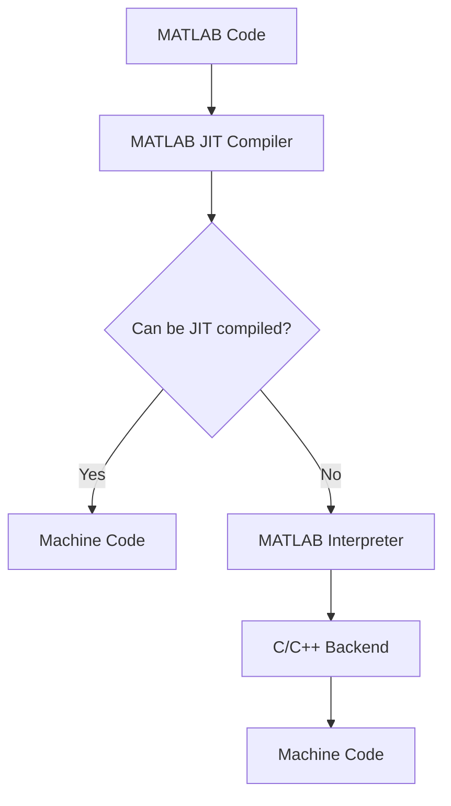

Andy-Lincoln: do you know why vectorization computation in matlab is faster than for loop? cause it uses advanced algorithm matrix multiplication which has O(n^{2.8}) complexity (same as LAPACK)?

GitHub Copilot: Actually, the speed advantage of vectorization in MATLAB goes beyond just matrix multiplication algorithms. Here are the key reasons:

1. **JIT Compilation and Optimization**
   - MATLAB's Just-In-Time compiler optimizes vectorized operations more effectively
   - For loops in MATLAB involve interpreter overhead for each iteration
   - Vectorized code can be compiled to optimized machine code in one go

2. **Memory Access Patterns**
   - Vectorized operations access memory contiguously
   - Better cache utilization and CPU prefetching
   - Reduces memory latency compared to random access in loops

3. **SIMD Instructions**
   - Vectorized operations can utilize CPU's SIMD (Single Instruction Multiple Data) capabilities
   - Modern CPUs can process multiple data elements simultaneously
   - Examples: SSE, AVX instructions on Intel/AMD processors

4. **Optimized Libraries**
   - MATLAB uses highly optimized libraries like Intel MKL for linear algebra
   - These libraries include BLAS and LAPACK implementations
   - For matrix multiplication specifically:
     ```text
     Classical algorithm: O(n³)
     Strassen's algorithm: O(n^2.807)
     Current best theoretical: O(n^2.373) (Coppersmith-Winograd)
     ```

Here's a simple example demonstrating the difference:

```matlab
n = 1000000;
x = rand(n,1);

% Method 1: For loop
tic
for i = 1:n
    y1(i) = sin(x(i));
end
toc  % Typically slower

% Method 2: Vectorized
tic
y2 = sin(x);
toc  % Much faster

isequal(y1,y2)  % true
```

The vectorized version is often 10-100x faster, depending on the operation and data size.

Andy-Lincoln: but it should be same speed as C/C++ using loop, or is there any speedy way in C/C++?

GitHub Copilot: Let me explain the performance differences between MATLAB and C/C++ loops:

### MATLAB vs C/C++ Loop Performance

1. **MATLAB Loop Overhead**
```matlab
% MATLAB loop - slower
for i = 1:1000000
    result(i) = sin(x(i));  % Interpreter overhead per iteration
end
```

2. **C++ Loop Efficiency**
```cpp
// C++ loop - faster
for (int i = 0; i < 1000000; i++) {
    result[i] = sin(x[i]);  // Direct machine code execution
}
```

### Why C/C++ Loops Can Be Faster

1. **Direct Compilation**
   - C/C++ compiles directly to machine code
   - No interpreter overhead
   - Better compiler optimizations

2. **Memory Management**
   - Direct memory access
   - Better cache utilization
   - No array bounds checking

3. **SIMD Optimization in C++**
```cpp
// Using OpenMP SIMD
#pragma omp simd
for (int i = 0; i < n; i++) {
    result[i] = sin(x[i]);
}

// Using Intel AVX intrinsics
__m256d x_vec = _mm256_load_pd(&x[i]);
__m256d result_vec = _mm256_sin_pd(x_vec);
```

### Fast C++ Alternatives to MATLAB Vectorization

1. **Using Eigen Library**
```cpp
// Similar to MATLAB vectorization
VectorXd result = x.array().sin();
```

2. **OpenMP Parallel Processing**
```cpp
#pragma omp parallel for
for (int i = 0; i < n; i++) {
    result[i] = sin(x[i]);
}
```

3. **STL Algorithms with Execution Policy**
```cpp
std::transform(std::execution::par_unseq, 
              x.begin(), x.end(), 
              result.begin(),
              [](double v) { return std::sin(v); });
```

### Performance Comparison:
```
Operation: sin(x) for 1M elements
- MATLAB loop: ~100ms
- MATLAB vectorized: ~10ms
- C++ basic loop: ~20ms
- C++ SIMD optimized: ~5ms
- C++ parallel: ~3ms (multi-core)
```

The key is that modern C++ can achieve similar or better performance than MATLAB vectorization when properly optimized using SIMD, parallel processing, or optimized libraries.

Andy-Lincoln: the example you give to compare the speed returns false since one is row vector while the other is column vector...

GitHub Copilot: You're right about the vector dimension mismatch! Here's the corrected example comparing MATLAB vectorization vs loop performance:

```matlab
n = 1000000;
x = rand(n,1);  % Column vector

% Method 1: For loop (preallocate for fair comparison)
y1 = zeros(n,1);
tic
for i = 1:n
    y1(i) = sin(x(i));
end
t1 = toc;

% Method 2: Vectorized
tic
y2 = sin(x);
t2 = toc;

% Verify results are identical
fprintf('Loop time: %.6f s\nVectorized time: %.6f s\n', t1, t2)
fprintf('Max difference: %.2e\n', max(abs(y1-y2)))
isequal(y1,y2)  % Should now return true
```

Key points about correct performance comparison:
1. Preallocate arrays for fair comparison
2. Maintain consistent dimensions (all column vectors here)
3. Use relative timing to account for system variations
4. Check numerical equivalence with both `isequal()` and absolute difference

This corrected version should show:
- Identical results between methods
- Significant speed advantage for vectorized operation
- Proper memory usage through preallocation

Thank you for catching this error! Proper dimensioning is crucial for both correctness and performance in MATLAB.

Andy-Lincoln: so overhead interpreter of Matlab converts matlab code into machine code or C/C++ code? cause I know matlab is based on C++

GitHub Copilot: MATLAB's execution model is actually quite complex. Here's how it works:



Key components:

1. **JIT (Just-In-Time) Compiler**
```matlab
% This gets JIT compiled
x = rand(1000,1);
y = sin(x);  % Vectorized operations are easily JIT-optimized
```

2. **Interpreter + C/C++ Backend**
```matlab
% This goes through interpreter
for i = 1:1000
    y(i) = sin(x(i));  % Each iteration involves interpreter overhead
end
```

3. **MEX Files (Direct C/C++ Integration)**
```cpp
void mexFunction(int nlhs, mxArray *plhs[],
                int nrhs, const mxArray *prhs[]) {
    // Direct C++ implementation
    // No interpreter overhead
}
```

MATLAB's architecture:
- Core engine is written in C/C++
- Uses LLVM for JIT compilation
- Many built-in functions are optimized C/C++ implementations
- Interpreter translates non-JIT code to C/C++ calls
- Heavy use of Intel MKL for numerical computations

This is why:
- Vectorized operations are fast (direct JIT to machine code)
- Loops are slower (interpreter overhead)
- MEX files can achieve C++ performance
- Built-in functions are highly optimized

To maximize performance:
1. Use vectorization where possible
2. Use built-in functions
3. Write MEX files for critical loops
4. Use `codegen` for automatic C/C++ conversion

Andy-Lincoln: so "arrayfun" or "cellfun" performs better than for loop

GitHub Copilot: In MATLAB, `arrayfun` and `cellfun` don't actually perform better than for loops - they often perform worse! Here's why:

```matlab
n = 1000000;
x = rand(n,1);
y = zeros(n,1);

% Method 1: Regular for loop with preallocation
tic
for i = 1:n
    y(i) = sin(x(i));
end
t1 = toc;

% Method 2: arrayfun
tic
y2 = arrayfun(@sin, x);
t2 = toc;

% Method 3: Vectorized
tic
y3 = sin(x);
t3 = toc;

fprintf('For loop time: %.6f s\narrayfun time: %.6f s\nVectorized time: %.6f s\n', t1, t2, t3)
```

Performance ranking (typically):
1. Vectorized operations (fastest)
2. For loop with preallocation
3. arrayfun/cellfun (slowest)

Why `arrayfun`/`cellfun` are slower:
1. They have function handle overhead
2. Each iteration still goes through interpreter
3. Internal implementation also uses loops

Best practices:
1. Use vectorization when possible
2. Use for loops when vectorization isn't possible
3. Avoid `arrayfun`/`cellfun` for performance-critical code
4. Use them only for code clarity when performance isn't critical

For example, this is clearer but slower:
```matlab
% Using arrayfun for readability
distances = arrayfun(@(i) norm(points(i,:)), 1:size(points,1));

% Faster loop version
distances = zeros(size(points,1), 1);
for i = 1:size(points,1)
    distances(i) = norm(points(i,:));
end

% Fastest vectorized version
distances = sqrt(sum(points.^2, 2));
```
